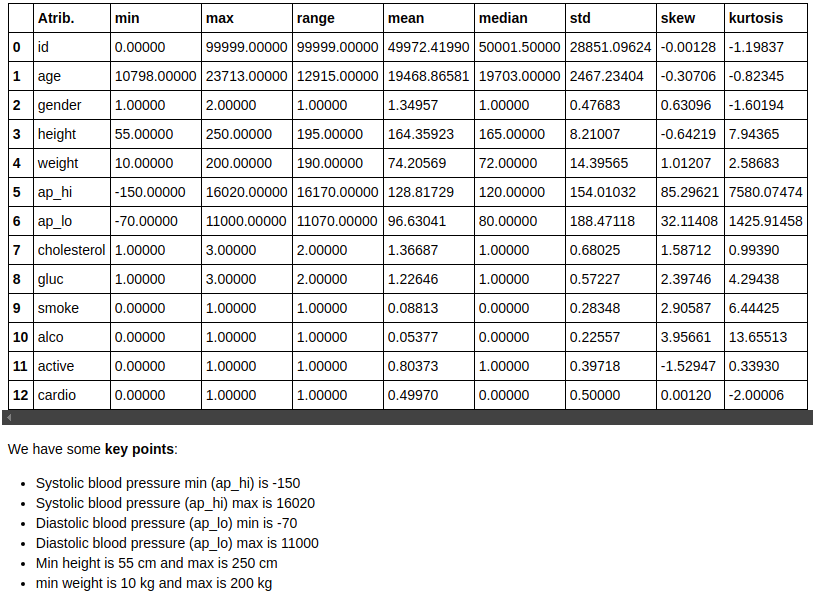
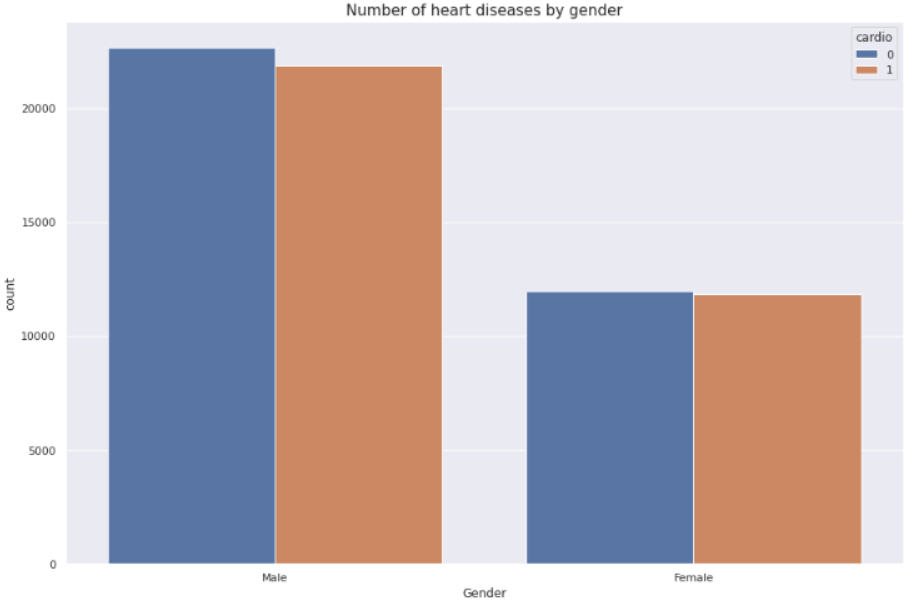

#  Predicting cardiovascular diseases

## Cardio Catch Diseases

### Problem
 

Cardio Catch Diseases is a company specialized in detecting heart disease in the early stages. Its business model lies in offering an early diagnosis of cardiovascular disease for a certain price.

Currently, the diagnosis of cardiovascular disease is manually made by a team of specialists. The current accuracy of the diagnosis varies between 55% and 65%, due to the complexity of the diagnosis and also the fatigue of the team who take turns to minimize the risks. The cost of each diagnosis, including the devices and the payroll of the analysts, is around $1,000.00.

The price of the diagnosis, paid by the client, varies according to the precision achieved by the team of specialists.

| Exam Accuracy | Price          | Rules                                    | Example                         |
|:--------------|:---------------|:-----------------------------------------|:--------------------------------|
| Above 50%     | min \$500\.00  | \+\$500 for each additional 5% precision | Precision = 55% \-> \$1,000\.00 |
| Up to 50%     | $0\.00         | N/A                                      | N/A                             |

We see that **different values in the exam precision**, given by the team of specialists, make the company either have a profitable operation, revenue greater than the cost, or an operation with a loss, revenue less than the cost. This instability of the diagnosis makes the company to have an **unpredictable cashflow**.

link : https://sejaumdatascientist.com/projeto-de-data-science-diagnostico-precoce-de-doencas-cardiovasculares/

# Solution

## Descriptive Statistical

## Exploratory data analysis

- H1 Heart disease cases depend significantly on the ideal weight (BMI)
	
**True**

- H2 Older people should be more likely to have heart disease

**True**
	

- H3 people who smoke should be more likely to be heart disease

**False**
	

- H4- People who intake alcohol should be more likely to have heart diseases

**False**
	

- H5- People who do not practice physical activity should be more likely to have heart disease

**True**
	

- H6- There are more cases of heart diseases for people presenting well above normal levels of cholesterol

**True**
	

- H7- There are more cases of heart diseases for people presenting High Stage 2 level of blood pressure

**True**
	

- H8- There are more cases of heart diseases for people presenting well above normal levels of glucose

**True**
	

- H9 Men should be more likely to get cardio disease than women.

**False**
	

## Cross-Validation summary

## Business performance

	

## Deploy Model

- The app was made with streamlit and deployed on heroku

- link : https://predict-cardio-disease.herokuapp.com/

## Next Steps

- Build a model retraining pipeline

- Carry out more cycles to discover facts that may be missing from our analysis, in order to enrich the data we have and **improve the performance** of the model.	

